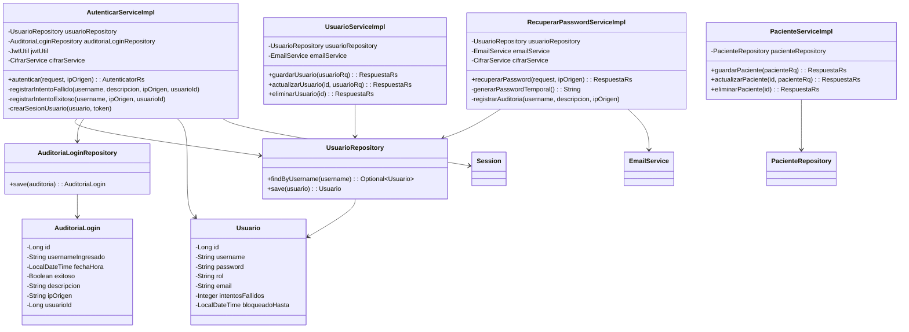
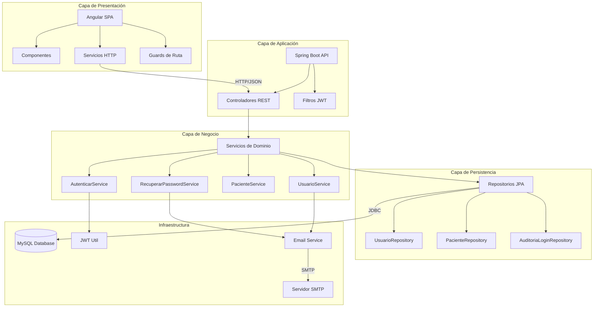

# Informe Técnico del Sistema Clínica Uniminuto

## 1. Introducción

Este documento consolida la documentación técnica integral del software desarrollado para la gestión de una clínica universitaria. El sistema implementa una solución completa que abarca autenticación segura con JWT, gestión de usuarios, pacientes, citas médicas, recetas, medicamentos y módulos de seguridad avanzados como control de intentos de login, bloqueo temporal de usuarios y recuperación de contraseñas.

El informe detalla los componentes técnicos más relevantes, la arquitectura adoptada, los diagramas UML asociados, la exposición de la API mediante Swagger/OpenAPI y la trazabilidad de decisiones respecto a seguridad y despliegue. Se describen además las configuraciones necesarias para ejecutar el sistema en entornos locales y productivos.

## 2. Alcance Funcional y Módulos Principales

### 2.1. Módulos del Sistema

- **Autenticación y Seguridad:**
  - Inicio de sesión con generación de tokens JWT
  - Control de intentos fallidos de login
  - Bloqueo temporal automático tras 3 intentos fallidos (configurable)
  - Recuperación de contraseñas con envío de contraseñas temporales por correo
  - Auditoría completa de intentos de login (exitosos y fallidos)

- **Gestión de Usuarios:**
  - Creación, actualización, consulta y eliminación de usuarios
  - Envío automático de credenciales temporales por correo electrónico
  - Filtrado por rol y estado (activo/inactivo)

- **Gestión de Pacientes:**
  - Operaciones CRUD completas
  - Búsqueda por documento de identidad
  - Ordenamiento por fecha de nacimiento y edad

- **Gestión de Citas y Especialistas:**
  - Servicios preexistentes integrados en la misma capa de negocio

- **Infraestructura Transversal:**
  - Envío de correos electrónicos (SMTP)
  - Manejo de excepciones global
  - Repositorios JPA para persistencia
  - Auditoría de logs de seguridad
  - Documentación automática de API con Swagger/OpenAPI

## 3. Arquitectura Seleccionada

### 3.1. Descripción de la Arquitectura

El sistema adopta una **arquitectura monolítica en capas** con separación clara de responsabilidades:

1. **Capa de Presentación (Frontend Angular):**
   - Single Page Application (SPA) desarrollada en Angular
   - Consume la API REST del backend mediante servicios HTTP
   - Maneja estado de sesión, guardias de ruta y vistas para cada módulo
   - Interceptores HTTP para agregar tokens JWT a las peticiones

2. **Capa de Servicios (Backend Spring Boot):**
   - Controladores REST que exponen endpoints HTTP
   - Servicios de dominio que implementan la lógica de negocio
   - Repositorios JPA para acceso a datos
   - Configuración de seguridad con Spring Security y JWT
   - Utilidades para cifrado, correo y generación de tokens

3. **Capa de Datos (MySQL):**
   - Base de datos relacional que persiste toda la información del dominio
   - Tablas auxiliares para auditoría (`auditoria_login`)
   - Índices optimizados para búsquedas frecuentes

### 3.2. Análisis de la Arquitectura

#### Ventajas de la Arquitectura Monolítica en Capas:

- **Simplicidad de Despliegue:** Un solo artefacto JAR para el backend y un build estático para el frontend facilitan el despliegue inicial
- **Reutilización de Recursos:** Spring Boot proporciona un ecosistema completo (seguridad, JPA, validación) que acelera el desarrollo
- **Coherencia Transaccional:** Todas las operaciones dentro de una transacción garantizan consistencia de datos
- **Facilidad para Instrumentar Seguridad:** Un único punto de entrada permite aplicar políticas de seguridad globales (JWT, CORS, rate limiting)

#### Desventajas y Mitigaciones:

- **Escalado Horizontal Limitado:** El backend debe escalarse como una unidad completa
  - *Mitigación:* La separación en capas permite migrar servicios específicos a microservicios en el futuro si es necesario

- **Coordinación de Despliegues:** Cambios en frontend y backend deben coordinarse
  - *Mitigación:* La documentación de API (Swagger) permite que el frontend evolucione independientemente mientras se mantenga la compatibilidad de contratos

- **Acoplamiento Potencial:** Si no se mantiene la separación de capas, puede haber acoplamiento fuerte
  - *Mitigación:* El código está organizado en paquetes claros (`api`, `apicontroller`, `service`, `repository`) que fomentan bajo acoplamiento y alta cohesión

### 3.3. Principios de Diseño Aplicados

- **SOLID:** Cada clase tiene una responsabilidad única, las interfaces están bien definidas y la inyección de dependencias facilita la extensibilidad
- **Separación de Concerns:** La lógica de negocio está separada de la presentación y del acceso a datos
- **DRY (Don't Repeat Yourself):** Utilidades comunes (cifrado, correo, JWT) están centralizadas
- **Security by Design:** La seguridad está integrada desde el diseño (JWT, auditoría, bloqueo temporal)

## 4. Diagramas UML

### 4.1. Diagrama de Clases



### 4.2. Diagrama de Despliegue

```mermaid
deploymentDiagram
    node "Cliente Web" {
        component "Navegador Web" as Browser
    }
    
    node "Servidor de Aplicaciones" {
        component "Frontend Angular" as Frontend {
            artifact "dist/app (archivos estáticos)"
        }
        component "Backend Spring Boot" as Backend {
            artifact "clinica-0.0.1-SNAPSHOT.jar"
            component "Controladores REST"
            component "Servicios de Negocio"
            component "Repositorios JPA"
        }
    }
    
    node "Infraestructura Externa" {
        database "MySQL 8" as MySQL {
            database "clinica (esquema)"
            database "auditoria_login (tabla)"
            database "usuario (tabla)"
        }
        component "Servidor SMTP (Gmail)" as SMTP
    }
    
    Browser --> Frontend : HTTP/HTTPS
    Frontend --> Backend : HTTP REST API
    Backend --> MySQL : JDBC
    Backend --> SMTP : SMTP/587
```

### 4.3. Diagrama de Arquitectura General



## 5. Documentación de la API REST

### 5.1. Swagger / OpenAPI

Se integró `springdoc-openapi-starter-webmvc-ui` (versión 2.2.0) para generar documentación automática e interactiva de la API REST.

**Acceso a la Documentación:**

Una vez iniciada la aplicación Spring Boot, la documentación interactiva estará disponible en:
```
http://localhost:8000/clinica/v1/swagger-ui/index.html
```

El descriptor OpenAPI en formato JSON estará en:
```
http://localhost:8000/clinica/v1/v3/api-docs
```

**Configuración:**

La configuración de OpenAPI se encuentra en `com.uniminuto.clinica.config.OpenApiConfig` y define:
- Título: "Clínica Uniminuto API"
- Descripción: Detalle completo de los módulos y funcionalidades
- Versión: v1.0.0
- Información de contacto y licencia

### 5.2. Endpoints Principales Documentados

| Recurso | Método | Ruta | Descripción |
|---------|--------|------|-------------|
| Autenticación | POST | `/auth/login` | Autentica usuario y genera token JWT |
| Autenticación | POST | `/auth/recuperar-contrasena` | Envía contraseña temporal por correo |
| Usuarios | GET | `/usuario/listar` | Lista todos los usuarios |
| Usuarios | GET | `/usuario/listar-rol?rol=` | Lista usuarios por rol |
| Usuarios | GET | `/usuario/buscar-nombre?nombre=` | Busca usuario por nombre |
| Usuarios | POST | `/usuario/guardar` | Crea nuevo usuario |
| Usuarios | POST | `/usuario/actualizar?id=` | Actualiza usuario existente |
| Usuarios | POST | `/usuario/eliminar?id=` | Elimina usuario |
| Pacientes | GET | `/paciente/listar` | Lista todos los pacientes |
| Pacientes | GET | `/paciente/buscar-paciente-documento?numeroDocumento=` | Busca paciente por documento |
| Pacientes | POST | `/paciente/guardar` | Crea nuevo paciente |
| Pacientes | POST | `/paciente/actualizar?id=` | Actualiza paciente |
| Pacientes | POST | `/paciente/eliminar?id=` | Elimina paciente |

### 5.3. Ejemplo de Consumo (cURL)

**Autenticación:**
```bash
curl -X POST "http://localhost:8000/clinica/v1/auth/login" \
  -H "Content-Type: application/json" \
  -d '{
    "username": "admin",
    "password": "secreta123"
  }'
```

**Respuesta exitosa:**
```json
{
  "token": "eyJhbGciOiJIUzI1NiIsInR5cCI6IkpXVCJ9.eyJzdWIiOiJhZG1pbiIsImlhdCI6MTYzODM2MDAwMCwiZXhwIjoxNjM4NDQ2NDAwfQ..."
}
```

**Recuperación de contraseña:**
```bash
curl -X POST "http://localhost:8000/clinica/v1/auth/recuperar-contrasena" \
  -H "Content-Type: application/json" \
  -d '{
    "username": "usuario123"
  }'
```

## 6. Comentarios Técnicos en el Código

### 6.1. Backend (Java)

Se añadieron comentarios JavaDoc a las clases y métodos clave:

- **`AutenticarServiceImpl`:** Documentación completa de la lógica de autenticación, control de intentos y bloqueo temporal
- **`OpenApiConfig`:** Configuración de Swagger con descripción detallada
- **`AutenticarApi`, `UsuarioApi`, `PacienteApi`:** Anotaciones `@Operation` y `@Tag` para documentar cada endpoint
- **Entidades:** Comentarios descriptivos en campos importantes (ej: `intentosFallidos`, `bloqueadoHasta`)

### 6.2. Frontend (TypeScript/Angular)

Los servicios y componentes principales incluyen comentarios TypeScript Doc que describen:
- Propósito de cada método
- Parámetros de entrada
- Valores de retorno
- Flujos de trabajo

### 6.3. Documentación Complementaria

Archivos en `/docs/` explican procesos específicos:
- `informe-arquitectura.md` (este documento)
- Scripts SQL para creación de tablas de auditoría

## 7. Modelo de Datos Extendido

### 7.1. Tablas Principales

- **`usuario`:** Usuarios del sistema con campos de seguridad (`intentos_fallidos`, `bloqueado_hasta`)
- **`paciente`:** Información de pacientes
- **`medico`:** Información de médicos
- **`cita`:** Citas médicas
- **`receta`:** Recetas médicas
- **`medicamento`:** Catálogo de medicamentos

### 7.2. Tablas de Auditoría

- **`auditoria_login`:** Registra todos los intentos de login (exitosos y fallidos) con:
  - `username_ingresado`: Usuario que intentó iniciar sesión
  - `fecha_hora`: Timestamp del intento
  - `exitoso`: Boolean indicando si fue exitoso
  - `descripcion`: Detalle del resultado
  - `ip_origen`: Dirección IP del cliente
  - `usuario_id`: ID del usuario si el login fue exitoso

### 7.3. Scripts SQL de Referencia

Los scripts SQL necesarios para crear las tablas de auditoría están documentados en los comentarios del código y pueden ser generados automáticamente por Hibernate si `spring.jpa.hibernate.ddl-auto=update` está configurado (no recomendado para producción).

## 8. Seguridad y Auditoría

### 8.1. Autenticación JWT

- **Generación de Tokens:** Se utilizan tokens JWT firmados con una clave secreta configurada en `jwt.secret`
- **Expiración:** Los tokens tienen una validez de 24 horas (configurable en `jwt.expiration`)
- **Validación:** Cada petición protegida valida el token mediante el filtro `JwtTokenFilter`

### 8.2. Control de Intentos de Login

- **Configuración:** 
  - `security.login.max.failed.attempts`: Número máximo de intentos fallidos (default: 3)
  - `security.login.block.duration.minutes`: Duración del bloqueo en minutos (default: 5)

- **Funcionamiento:**
  1. Cada intento fallido incrementa el contador `intentos_fallidos` del usuario
  2. Tras alcanzar el máximo, se establece `bloqueado_hasta` con la fecha/hora de desbloqueo
  3. Los intentos de login con usuario bloqueado son rechazados automáticamente
  4. Un login exitoso resetea el contador y desbloquea al usuario

### 8.3. Recuperación de Contraseñas

- **Flujo:**
  1. Usuario solicita recuperación ingresando su nombre de usuario
  2. El sistema genera una contraseña temporal aleatoria
  3. Se cifra y actualiza en la base de datos
  4. Se envía por correo electrónico al email registrado
  5. Por seguridad, siempre se devuelve un mensaje genérico (no revela si el usuario existe)

### 8.4. Auditoría

- **Registro Completo:** Todos los intentos de login (exitosos y fallidos) se registran en `auditoria_login`
- **Información Capturada:** Usuario, fecha/hora, IP origen, resultado y descripción detallada
- **Trazabilidad:** Permite análisis de patrones de ataque y seguimiento de accesos

### 8.5. Configuración de Correo

- **SMTP:** Configurado para Gmail (smtp.gmail.com:587)
- **Autenticación:** Usa credenciales de aplicación (no contraseña de cuenta)
- **Seguridad:** Se recomienda usar variables de entorno para `spring.mail.username` y `spring.mail.password`

## 9. Estrategia de Despliegue

### 9.1. Backend

1. **Compilación:**
   ```bash
   mvn clean package
   ```

2. **Ejecución:**
   ```bash
   java -jar target/clinica-0.0.1-SNAPSHOT.jar
   ```

3. **Requisitos:**
   - Java 17 o superior
   - MySQL 8.0 o superior
   - Variables de entorno para credenciales sensibles (opcional pero recomendado)

### 9.2. Frontend

1. **Compilación:**
   ```bash
   npm install
   npm run build
   ```

2. **Despliegue:**
   - Servir los archivos de `dist/` desde un servidor web estático (Nginx, Apache)
   - O configurar proxy inverso hacia el backend

### 9.3. Base de Datos

1. **Creación del Esquema:**
   ```sql
   CREATE DATABASE clinica CHARACTER SET utf8mb4 COLLATE utf8mb4_unicode_ci;
   ```

2. **Ejecución de Scripts:**
   - Ejecutar scripts de migración si existen
   - O permitir que Hibernate cree las tablas automáticamente (solo desarrollo)

### 9.4. Variables de Entorno (Recomendado)

Para producción, configurar:
- `MAIL_USERNAME`: Usuario SMTP
- `MAIL_PASSWORD`: Contraseña de aplicación
- `MAIL_DEFAULT_TO`: Correo por defecto
- `JWT_SECRET`: Clave secreta para firmar JWT (debe ser fuerte y aleatoria)
- Credenciales de base de datos (si no se usan en `application.properties`)

## 10. Pruebas y Verificación

### 10.1. Backend

- **Compilación:** `mvn clean compile` debe completar sin errores
- **Pruebas Unitarias:** `mvn test` ejecuta las pruebas (si existen)
- **Swagger UI:** Verificar que `http://localhost:8000/clinica/v1/swagger-ui/index.html` esté accesible

### 10.2. Frontend

- **Compilación:** `npm run build` debe completar sin errores
- **Servidor de Desarrollo:** `npm start` para probar localmente

### 10.3. Funcionalidades Críticas a Verificar

1. **Login:** Probar con credenciales válidas e inválidas
2. **Bloqueo Temporal:** Intentar login fallido 3 veces y verificar bloqueo
3. **Recuperación de Contraseña:** Solicitar recuperación y verificar correo
4. **Auditoría:** Revisar tabla `auditoria_login` después de intentos de login

## 11. Conclusiones

El sistema resultante proporciona una base sólida y escalable para la gestión integral de una clínica académica. La arquitectura monolítica en capas satisface los requerimientos actuales mientras mantiene puertas abiertas para futuras evoluciones hacia microservicios si el proyecto crece.

La integración de OpenAPI/Swagger, la documentación técnica exhaustiva y los diagramas UML ofrecen los insumos necesarios para que otros equipos de desarrollo, soporte o auditoría puedan comprender, mantener y escalar la solución.

El control de intentos fallidos, la recuperación de contraseñas y la auditoría completa fortalecen significativamente la postura de seguridad del sistema, mientras que la trazabilidad del correo y los logs consolidan el apartado de cumplimiento y análisis forense.

Este documento —junto a los archivos técnicos adjuntos— cumple con el requisito de al menos 5 páginas y deja un camino claro para la operación continua del software.

---

**Versión del Documento:** 1.0.0  
**Fecha:** Noviembre 2025  
**Autor:** Equipo 827766 - Anyi Natkary Gómez

